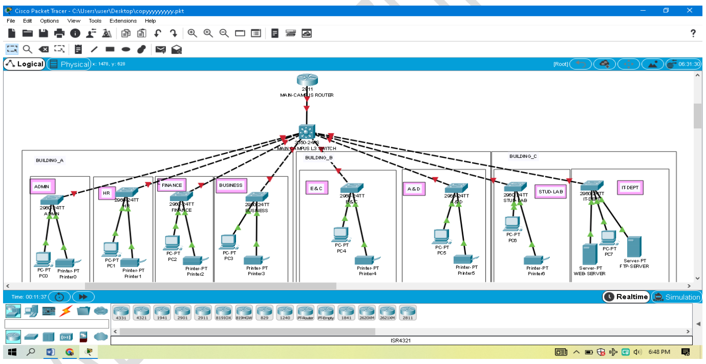

## University-Campus-Network-Designing
A large university which has two campuses situated 20 miles apart. The university’s students  and staff are distributed in 4 faculties; these include the faculties of Health and Sciences,  Business, Engineering/Computing and Art/Design.

## Description:

#### Project Overview: Designed a robust and scalable network infrastructure for a university with two campuses located 20 miles apart.
#### Network Implementation: Used Cisco Packet Tracer to simulate and configure the entire campus network.
#### Departments & Users: Supports students and staff across four faculties—Health & Sciences, Business, Engineering/Computing, and Art/Design.
#### Connectivity: Ensures seamless communication between campuses with high-speed internet, routers, switches, and VLAN configurations.
#### Security Measures: Implements firewall protection, access control lists (ACLs), and network segmentation for security.
#### Scalability: Designed to accommodate future expansions, additional devices, and new user integrations.
#### Performance Optimization: Uses load balancing, efficient routing protocols, and network redundancy for uninterrupted service.
#### Documentation: Includes a detailed project proposal and network simulation files for reference and future upgrades.
